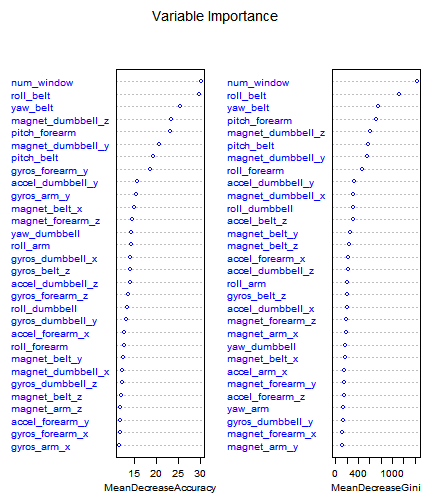
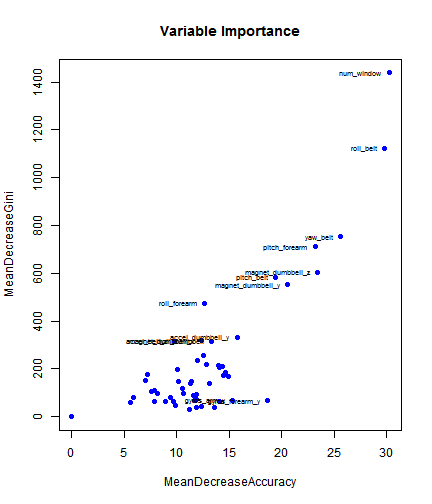
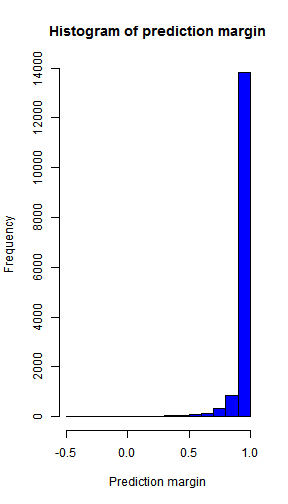
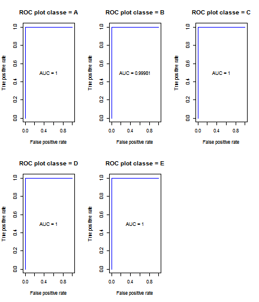

# Summary

This report presents a statistical learning model based on Random Forests to predict the manner of execution of weight lifting exercises, using the dataset that was originally created by Velloso, E., Bulling, A., Gellersen, H., Ugulino, W. and Fuks, H. The base model that incorporates all variables is refined in subsequent steps to obtain a parsimonious model with seven predictors. The model's out of sample error rate is estimated at 0.18%.

# Introduction

Wearable sensors were used to collect data on weight lifting exercises performed by 6 people. They were asked to perform barbell lifts correctly and incorrectly in 5 different ways. This study analyzes the data and builds a prediction model using statistical learning to classify the manner in which these people performed the exercise.
 
This report uses the Weight Lifting exercise Dataset prepared by [Velloso et al](http://groupware.les.inf.puc-rio.br/har).

The training data for this project are available here: 
[https://d396qusza40orc.cloudfront.net/predmachlearn/pml-training.csv]

The test data are available here: 
[https://d396qusza40orc.cloudfront.net/predmachlearn/pml-testing.csv]

# Exploratory Analysis

Load the R packages used by this study.


```r
library(knitr)
opts_knit$set(progress=TRUE, verbose=TRUE, self_contained=FALSE)
library(caret)
```

```
## Loading required package: lattice
## Loading required package: ggplot2
```

```r
library(randomForest)
library(ROCR)
```

We first perform a few basic format conversions to prepare the data for further analysis. The response variable is "classe".


```r
# Read data
# rm(list=ls())
training <- read.csv("pml-training.csv", header=TRUE, colClasses="character")
predicting <- read.csv("pml-testing.csv", header=TRUE, colClasses="character")

# Clean data
cleanData <- function(x) {
    # convert categorical variables to factor and numeric variables to numeric
    # warnings may arise from invalid numeric values, eg #DIV/0! will be converted to NA
    x[, c(1, 2, 6, 160)] <- lapply(x[, c(1, 2, 6, 160)], factor)
    x[, c(7:159)] <- lapply(x[, c(7:159)], as.numeric)
    
    # convert dates
    x[, c(3:4)] <- lapply(x[, c(3:4)], as.numeric)
    x$tsPosixct <- lapply(x$raw_timestamp_part_1, as.POSIXct, origin = "1970-01-01")
    x$tsDate <- sapply(x$tsPosixct, format, "%d/%m/%Y")
    x$tsTime <- sapply(x$tsPosixct, format, "%H:%M:%S")
    x[, c("tsDate", "tsTime")] <- lapply(x[, c("tsDate", "tsTime")], factor)
    return(x)
}
training <- cleanData(training)
predicting <- cleanData(predicting)
print(dim(training))
```

```
## [1] 19622   163
```

The raw data consists of 163 variables with 19622 data points. 


```r
# Exploratory analysis
# Analyze for missing values
colNA <- sapply(training, function(x) sum(is.na(x)))
```

There are 63 variables without NA values. There are 100 variables with a total of 1925102 NA values. Below we investigate the variables with the highest number of missing values.


```r
print(table(colNA[colNA > 0]))
```

```
## 
## 19216 19217 19218 19220 19221 19225 19226 19227 19248 19293 19294 19296 
##    67     1     1     1     4     1     4     2     2     1     1     2 
## 19299 19300 19301 19622 
##     1     4     2     6
```

```r
# Many variables have 19216 NA rows, let's investigate
# Get the rows that have some value in them
training.na <- training[!is.na(training$max_roll_belt),]
# Investigate the columns that have so many NA
training.na <- cbind(training.na[,1:7], training.na[, colNA > 0])
# print(summary(training.na))
print(colnames(training.na))
```

```
##   [1] "X"                        "user_name"               
##   [3] "raw_timestamp_part_1"     "raw_timestamp_part_2"    
##   [5] "cvtd_timestamp"           "new_window"              
##   [7] "num_window"               "kurtosis_roll_belt"      
##   [9] "kurtosis_picth_belt"      "kurtosis_yaw_belt"       
##  [11] "skewness_roll_belt"       "skewness_roll_belt.1"    
##  [13] "skewness_yaw_belt"        "max_roll_belt"           
##  [15] "max_picth_belt"           "max_yaw_belt"            
##  [17] "min_roll_belt"            "min_pitch_belt"          
##  [19] "min_yaw_belt"             "amplitude_roll_belt"     
##  [21] "amplitude_pitch_belt"     "amplitude_yaw_belt"      
##  [23] "var_total_accel_belt"     "avg_roll_belt"           
##  [25] "stddev_roll_belt"         "var_roll_belt"           
##  [27] "avg_pitch_belt"           "stddev_pitch_belt"       
##  [29] "var_pitch_belt"           "avg_yaw_belt"            
##  [31] "stddev_yaw_belt"          "var_yaw_belt"            
##  [33] "var_accel_arm"            "avg_roll_arm"            
##  [35] "stddev_roll_arm"          "var_roll_arm"            
##  [37] "avg_pitch_arm"            "stddev_pitch_arm"        
##  [39] "var_pitch_arm"            "avg_yaw_arm"             
##  [41] "stddev_yaw_arm"           "var_yaw_arm"             
##  [43] "kurtosis_roll_arm"        "kurtosis_picth_arm"      
##  [45] "kurtosis_yaw_arm"         "skewness_roll_arm"       
##  [47] "skewness_pitch_arm"       "skewness_yaw_arm"        
##  [49] "max_roll_arm"             "max_picth_arm"           
##  [51] "max_yaw_arm"              "min_roll_arm"            
##  [53] "min_pitch_arm"            "min_yaw_arm"             
##  [55] "amplitude_roll_arm"       "amplitude_pitch_arm"     
##  [57] "amplitude_yaw_arm"        "kurtosis_roll_dumbbell"  
##  [59] "kurtosis_picth_dumbbell"  "kurtosis_yaw_dumbbell"   
##  [61] "skewness_roll_dumbbell"   "skewness_pitch_dumbbell" 
##  [63] "skewness_yaw_dumbbell"    "max_roll_dumbbell"       
##  [65] "max_picth_dumbbell"       "max_yaw_dumbbell"        
##  [67] "min_roll_dumbbell"        "min_pitch_dumbbell"      
##  [69] "min_yaw_dumbbell"         "amplitude_roll_dumbbell" 
##  [71] "amplitude_pitch_dumbbell" "amplitude_yaw_dumbbell"  
##  [73] "var_accel_dumbbell"       "avg_roll_dumbbell"       
##  [75] "stddev_roll_dumbbell"     "var_roll_dumbbell"       
##  [77] "avg_pitch_dumbbell"       "stddev_pitch_dumbbell"   
##  [79] "var_pitch_dumbbell"       "avg_yaw_dumbbell"        
##  [81] "stddev_yaw_dumbbell"      "var_yaw_dumbbell"        
##  [83] "kurtosis_roll_forearm"    "kurtosis_picth_forearm"  
##  [85] "kurtosis_yaw_forearm"     "skewness_roll_forearm"   
##  [87] "skewness_pitch_forearm"   "skewness_yaw_forearm"    
##  [89] "max_roll_forearm"         "max_picth_forearm"       
##  [91] "max_yaw_forearm"          "min_roll_forearm"        
##  [93] "min_pitch_forearm"        "min_yaw_forearm"         
##  [95] "amplitude_roll_forearm"   "amplitude_pitch_forearm" 
##  [97] "amplitude_yaw_forearm"    "var_accel_forearm"       
##  [99] "avg_roll_forearm"         "stddev_roll_forearm"     
## [101] "var_roll_forearm"         "avg_pitch_forearm"       
## [103] "stddev_pitch_forearm"     "var_pitch_forearm"       
## [105] "avg_yaw_forearm"          "stddev_yaw_forearm"      
## [107] "var_yaw_forearm"
```

```r
print(dim(training.na))
```

```
## [1] 406 107
```

406 rows apparently contain a summary of exercises performed previously, providing min, max, stddev, mean, and var metrics. It is decided to remove these rows, by selecting new_window != yes.

Also all variables with missing values are removed, as imputing would be impractical given the large number of missing values (19216 or more of a total of 19622 data rows).


```r
training <- training[training$new_window != "yes",]
training <- training[, colNA == 0]
print(dim(training))
```

```
## [1] 19216    63
```

After removing variables with missing values there are 63 variables remaining with 0 missing values.

# Prediction Study Design

Before we start building the model we remove a few more variables such as the raw timestamps. Also the time variable is removed.


```r
# Columns to exclude from model
colToExclude <- c("X", "raw_timestamp_part_1", "raw_timestamp_part_2", "cvtd_timestamp", "tsPosixct")
# Exclude tsTime as well, because rf can't handle predictors with more than 53 categories
colToExclude <- c(colToExclude, "tsTime")
idxToExclude <- which(colnames(training) %in% colToExclude)
training <- training[,-idxToExclude]
```

Next we split the data set in a training set (80%) and a test set (20%). The response variable classe has five classes. A random selection is made within each class separately using the function createDataPartition (caret).


```r
# Data preparation
print(table(training$classe))
```

```
## 
##    A    B    C    D    E 
## 5471 3718 3352 3147 3528
```

```r
set.seed(111)
# split data in 80% training, 20% testing
# caret createDataPartition makes random selection within each class 
# library(caret)
ind <- createDataPartition(y=training$classe, p=0.8, list=FALSE)
trn <- training[ind,]; tst <- training[-ind,]
print(table(trn$classe)); print(table(tst$classe))
```

```
## 
##    A    B    C    D    E 
## 4377 2975 2682 2518 2823
```

```
## 
##    A    B    C    D    E 
## 1094  743  670  629  705
```

# Model Construction

The model will be built using a Random Forests approach. Random Forests is a modelling method that is particularly suited for multi-value classification models. It grows decision trees on different parts of the training set and averages the fitted trees to obtain a tree that has low bias and reduced variance. Unlike bootstrap aggregating (bagging) Random Forests selects from a subset of variables at each candidate split (tree node) in the learning process. Cross validation is performed by the Random Forests algorithm itself, using the Out Of Bag or out of sample error as the estimate how well the model will perform on the unseen test data. 

This study does not investigate the applicability of other modelling methods for the weight lifting exercise data set at hand. 

The following steps are taken to build the final model:

- Fit a Random Forests model on the training set, and use the mtry parameter to find an optimal setting for m, the number of randomly selected variables that is considered for a new node split.
- Using the model obtained with the optimal setting for m, create refined models by selecting variables based on their importance in the first model. Model refinement is done using two mtry settings: 3, and the default setting square root of p, the number of variables.
- Select the model that performs best, according to the Out Of Bag error rate.


```r
# Function to calculate Out Of Bag error rate
# library(randomForest)
oobError <- function(model.rf) {
    # get confusion matrix
    cm <- model.rf$confusion[,1:length(model.rf$classes)]
    # out of bag estimate of error rate
    return((sum(cm) - sum(diag(cm))) / sum(cm))
}
```

## Initial Model

First we obtain the best value of m, the number of randomly selected variables to consider for each new tree node. We analyze with all variables (bagging), half of the variables, a range between 6 and 12, and 3.


```r
# Exclude total_ variables
trnCols <- !grepl("^total_", colnames(trn))
# Fit models
modelComparison <- data.frame(mtry=0, oobError=0)
models <- lapply(c(ncol(trn[,trnCols])-1, 26, 12:6, 3), function(m) {
    set.seed(1111)
    nt <- 100
    # print(paste("mtry =", m, "ntree =", nt))
    fit.rf <- randomForest(classe ~ ., data=trn[,trnCols], mtry=m, ntree=nt, importance=TRUE)
    model <- list(mtry = m, fit.rf = fit.rf, oobErr = oobError(fit.rf))
})
modelComparison <- matrix(data=c(sapply(models, "[", 1), sapply(models, "[", 3)), byrow = FALSE, ncol=2)
colnames(modelComparison) <- c("mtry", "oobErr")

# Find model with best oobError and lowest mtry
print(modelComparison)
```

```
##       mtry oobErr     
##  [1,] 52   0.005788618
##  [2,] 26   0.002406504
##  [3,] 12   0.001691057
##  [4,] 11   0.001886179
##  [5,] 10   0.002406504
##  [6,] 9    0.002471545
##  [7,] 8    0.002601626
##  [8,] 7    0.002211382
##  [9,] 6    0.003186992
## [10,] 3    0.003577236
```

```r
print(which.min(modelComparison[,2]))
```

```
## [1] 3
```

```r
# Continue with this model
m <- which.min(modelComparison[,2])
mtry <- models[[m]]$mtry
imp <- as.data.frame(importance(models[[m]]$fit.rf)[,c("MeanDecreaseAccuracy","MeanDecreaseGini")])
```

A value of 12 appears to give an optimal result. The figure below shows the relative importance of the variables used in the model. The long tails have little separation between the individual values. It suggests that the model can be simplified considerably without making too big a concession to the model's expected performance.


```r
# Variable importance plot
# library(randomForest)
randomForest::varImpPlot(models[[m]]$fit.rf, main = "Variable Importance", col="blue", cex=0.8)
```

 

## Model Refinement

To make the model more parsimonious while keeping prediction accuracy acceptable we remove variables with the lowest Mean Decrease Accuracy and Mean Decrease Gini values. These diagnostics indicate the extent to which the variables have an improving effect on the model's prediction performance and classification of the data. The Gini coefficient is a measure for the homogeneity (purity) of the nodes and leaves in the forest.


```r
print(summary(imp$MeanDecreaseAccuracy))
```

```
##    Min. 1st Qu.  Median    Mean 3rd Qu.    Max. 
##   0.000   9.868  11.910  13.000  14.400  30.220
```

```r
print(summary(imp$MeanDecreaseGini))
```

```
##    Min. 1st Qu.  Median    Mean 3rd Qu.    Max. 
##     0.0    67.7   143.3   233.7   241.9  1439.0
```

The figure below shows that the variables in the upper right corner might be the most important ones for the final model.


```r
with(imp, plot(MeanDecreaseAccuracy, MeanDecreaseGini, main="Variable Importance", pch=19, col="blue"))
impPlotData <- imp[imp$MeanDecreaseAccuracy > 15 | imp$MeanDecreaseGini > 300,]
with(impPlotData, text(MeanDecreaseAccuracy, MeanDecreaseGini, 
                       labels = rownames(impPlotData), cex = 0.6, pos = 2))
```

 

Before we draw this conclusion we generate different models based on different sets of variables. Starting with the full list of variables, with each step we remove an increasing number of the lesser important variables.


```r
# Stepwise remove variables to obtain a parsimonious model with acceptable accuracy
# Candidates for removal are variables with lowest MDA and MDG

# Data variable selection
# Baseline model includes all variables (p), the others drop variables of lowest importance 
rmVars <- list(
    c(""),
    rownames(imp[imp$MeanDecreaseAccuracy < 10 & imp$MeanDecreaseGini < 75,]),
    rownames(imp[imp$MeanDecreaseAccuracy < 13 & imp$MeanDecreaseGini < 145,]),
    rownames(imp[imp$MeanDecreaseAccuracy < 14 & imp$MeanDecreaseGini < 145,]),
    rownames(imp[imp$MeanDecreaseAccuracy < 14 & imp$MeanDecreaseGini < 200,]),
    rownames(imp[imp$MeanDecreaseAccuracy < 14 & imp$MeanDecreaseGini < 235,]),
    rownames(imp[imp$MeanDecreaseAccuracy < 14 & imp$MeanDecreaseGini < 250,]),
    rownames(imp[imp$MeanDecreaseAccuracy < 20 & imp$MeanDecreaseGini < 250,]),
    rownames(imp[imp$MeanDecreaseAccuracy < 20 & imp$MeanDecreaseGini < 500,]),
    rownames(imp[imp$MeanDecreaseAccuracy < 22 & imp$MeanDecreaseGini < 500,]),
    rownames(imp[imp$MeanDecreaseAccuracy < 22 & imp$MeanDecreaseGini < 650,])
)
```

For each subset of variables the model is generated with mtry set to 3 and with the default setting of mtry, the square root of the number of variables.

We compare the resulting models and select the one with the lowest Out Of Bag error rate. 


```r
# Fit models
# Iterate in reverse order, starting with minimum nr of variables
models2 <- lapply(c(3, 0), function(mtry) {
    models2 <- lapply(rev(rmVars), function(v) {
        nt <- 100
        trn2 <- trn[,!colnames(trn[,trnCols]) %in% v]
        # print(paste("mtry =", mtry, "ntree =", nt, "variables =", ncol(trn2)-1))
        set.seed(1111)
        if (mtry > 0) {
            # specific value for mtry
            fit.rf <- randomForest(classe ~ ., data=trn2, mtry=mtry, ntree=nt, importance=TRUE)
        }
        else {
            # default value for mtry: sqrt(p) 
            fit.rf <- randomForest(classe ~ ., data=trn2, ntree=nt, importance=TRUE)        
        }            
        model <- list(mtry = fit.rf$mtry, fit.rf = fit.rf, oobErr = oobError(fit.rf), 
                      nVars = ncol(trn2)-1, vars = setdiff(colnames(trn2), "classe"), rmVars = v)
    })
})
models2 <- c(models2[[1]], models2[[2]])
modelComparison2 <- matrix(data=c(sapply(models2, "[", 1), 
                                  sapply(models2, "[", 3),
                                  sapply(models2, "[", 4)), 
                           byrow = FALSE, ncol=3)
colnames(modelComparison2) <- c("mtry", "oobErr", "nVars")

# Find model with best oobError and lowest nr of variables 
print(modelComparison2)
```

```
##       mtry oobErr       nVars
##  [1,] 3    0.0009105691 7    
##  [2,] 3    0.00104065   9    
##  [3,] 3    0.00104065   9    
##  [4,] 3    0.002276423  15   
##  [5,] 3    0.003642276  23   
##  [6,] 3    0.003642276  24   
##  [7,] 3    0.003642276  26   
##  [8,] 3    0.00403252   31   
##  [9,] 3    0.00403252   33   
## [10,] 3    0.004292683  49   
## [11,] 3    0.003707317  56   
## [12,] 2    0.001430894  7    
## [13,] 3    0.00104065   9    
## [14,] 3    0.00104065   9    
## [15,] 3    0.002276423  15   
## [16,] 4    0.00195122   23   
## [17,] 4    0.002081301  24   
## [18,] 5    0.002536585  26   
## [19,] 5    0.002731707  31   
## [20,] 5    0.003056911  33   
## [21,] 7    0.002666667  49   
## [22,] 7    0.002601626  56
```

```r
print(which.min(modelComparison2[,2]))
```

```
## [1] 1
```

```r
# Continue with this final model
m <- which.min(modelComparison2[,2])
final <- models2[[m]]$fit.rf
finalCols <- models2[[m]]$vars
```

The final model uses 7 variables.


```r
# Final model and some diagnostics
print(final)
```

```
## 
## Call:
##  randomForest(formula = classe ~ ., data = trn2, mtry = mtry,      ntree = nt, importance = TRUE) 
##                Type of random forest: classification
##                      Number of trees: 100
## No. of variables tried at each split: 3
## 
##         OOB estimate of  error rate: 0.09%
## Confusion matrix:
##      A    B    C    D    E  class.error
## A 4377    0    0    0    0 0.0000000000
## B    0 2973    1    0    1 0.0006722689
## C    0    3 2678    1    0 0.0014914243
## D    0    0    1 2516    1 0.0007942812
## E    1    2    0    3 2817 0.0021253985
```

```r
# Usage frequency of variables
# library(randomForest)
print(randomForest::varUsed(final, by.tree=FALSE, count=TRUE))
```

```
## [1] 11009  4910  6049  4514  4530  4091   339
```

```r
# Importance
print(randomForest::importance(final))
```

```
##                          A        B        C        D        E
## num_window        61.38658 60.45295 81.78776 55.74778 30.86072
## roll_belt         24.23348 41.93334 32.56933 39.74925 34.84604
## yaw_belt          23.54533 40.90853 34.79908 36.64446 16.86775
## accel_dumbbell_z  26.57164 27.84391 25.40782 30.42741 29.12394
## magnet_dumbbell_y 25.41971 31.16803 41.11992 35.86792 24.94813
## accel_forearm_z   14.49214 17.04572 17.51552 17.71407 18.17184
## tsDate            10.13436 12.83160 11.38402 10.93579 10.72579
##                   MeanDecreaseAccuracy MeanDecreaseGini
## num_window                    83.95659        4832.5973
## roll_belt                     48.15301        2160.8678
## yaw_belt                      42.76166        1762.1695
## accel_dumbbell_z              33.11120        1250.3234
## magnet_dumbbell_y             35.39380        1424.9423
## accel_forearm_z               23.46304         496.0946
## tsDate                        13.36371         227.2153
```


```r
# Importance plot
# library(randomForest)
randomForest::varImpPlot(final, n.var = models2[[m]]$nVars, main="Variable Importance", pch=19, col="blue", cex=0.8)
```

 

The plot of variable importance shows that the seven remaining variables in the model are all having a significant influence on the accuracy of the classification and on the purity of the nodes and leaves. The long tail of variables with similar importance scores has disappeared. In the next section we will analyze the expected classification performance of the new model.

## Expected Performance

To assess the expected prediction performance on the test set we look at the plots of the margins of prediction and the ROC curve of the trained model.

The margin of a data point is the proportion of votes for the correct class minus the maximum proportion of votes for the other classes. If the margin is positive it means the data point is correctly classified. One means perfect classification, zero means that the model does not clearly classify, whereas minus one would mean a fully imperfect classification.

The histogram shows that forthe vast majority of data points are perfectly classified.


```r
# Margins of prediction
# library(randomForest)
hist(randomForest::margin(final), col="blue", main="Histogram of prediction margin", xlab="Prediction margin")
```

 

The ROC (receiver operating characteristics) curve is a graphical plot that depicts the performance of a binary classification model. It compares the true positive rate (vertical axis) and the false positive rate (horizontal axis). 

Because our model uses five classes, we show a curve for each class to assess the classification performance for each outcome (A/Not A, B/Not B, etc.).

The curves show that the model is performing very well for all outcomes.


```r
# ROC plot using ROCR library
# Show a ROC curve for each class prediction.
# Note: ROCR supports two-valued classification only (true/false, A/not A, etc).
# library(ROCR)
votes <- as.data.frame(final$votes)
op <- par(mfrow=c(2,3))
for (className in levels(trn$classe)) {
    # message(className)
    predictions <- as.numeric(votes[,className])
    correctClass <- grepl(className, trn$classe)
    pred <- ROCR::prediction(predictions, labels=correctClass)
    # Area under curve
    perfAuc <- ROCR::performance(pred, "auc")
    auc <- perfAuc@y.values[[1]]
    # ROC curve
    perfRoc <- ROCR::performance(pred,"tpr","fpr")
    ROCR::plot(perfRoc, main=paste("ROC plot", "classe =", className), col="blue")
    text(0.5, 0.5, paste("AUC =", format(auc, digits=5, scientific=FALSE)))
}
par(op)
```

 

# Model Validation

We now validate the model against the test set.


```r
# Validate using test set
pred.rf <- predict(final, newdata=tst[,finalCols], type="response")
pred.table <- table(observed = tst$classe, predicted = pred.rf)
print(pred.table)
```

```
##         predicted
## observed    A    B    C    D    E
##        A 1094    0    0    0    0
##        B    1  742    0    0    0
##        C    0    3  667    0    0
##        D    0    0    0  629    0
##        E    0    2    0    1  702
```

```r
print((sum(pred.table) - sum(diag(pred.table))) / sum(pred.table))
```

```
## [1] 0.001822442
```

The out of sample error rate in a classification model is calculated as the ratio of misclassifications. The out of sample error of our 7-variable Random Forests model is 0.18%. We therefore accept this model as the final one to use for classifying the prediction set.

# Prediction

We now predict the classes of the 20 observations in the pml-testing.csv dataset.


```r
# Predict answers
answers <- predict(final, newdata=predicting[,finalCols])
print(answers)
```

```
##  1  2  3  4  5  6  7  8  9 10 11 12 13 14 15 16 17 18 19 20 
##  B  A  B  A  A  E  D  B  A  A  B  C  B  A  E  E  A  B  B  B 
## Levels: A B C D E
```

Output the result to separate files using the code suggested in the assignment.


```r
# Export answers to separate text files using Coursera script
pml_write_files = function(x){
    n = length(x)
    for(i in 1:n){
        filename = paste0("problem_id_",i,".txt")
#        write.table(x[i],file=filename,quote=FALSE,row.names=FALSE,col.names=FALSE)
    }
}
pml_write_files(answers)
```

# References

Velloso, E.; Bulling, A.; Gellersen, H.; Ugulino, W.; Fuks, H. [Qualitative Activity Recognition of Weight Lifting Exercises](http://groupware.les.inf.puc-rio.br/work.jsf?p1=11201]). Proceedings of 4th International Conference in Cooperation with SIGCHI (Augmented Human '13) . Stuttgart, Germany: ACM SIGCHI, 2013. 
